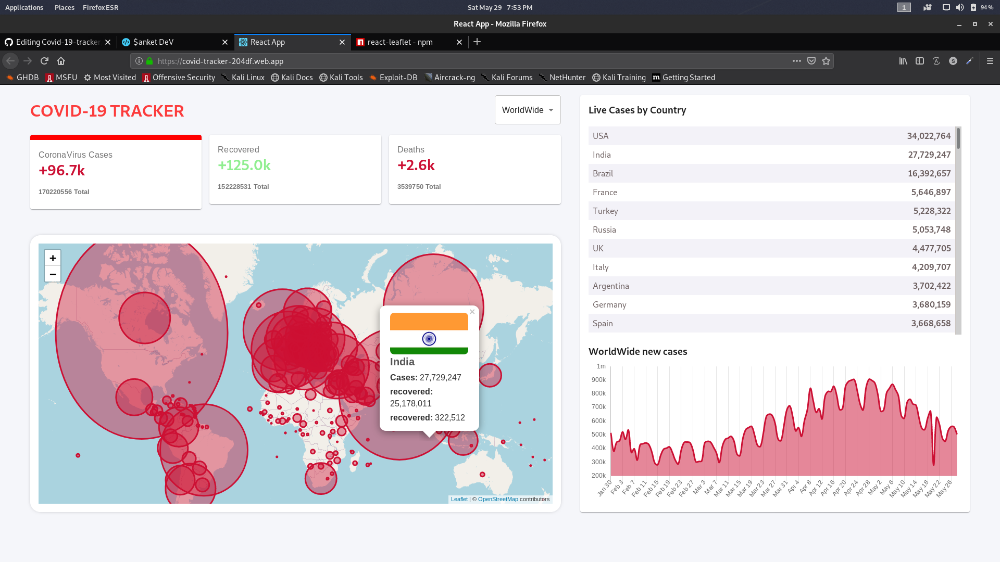
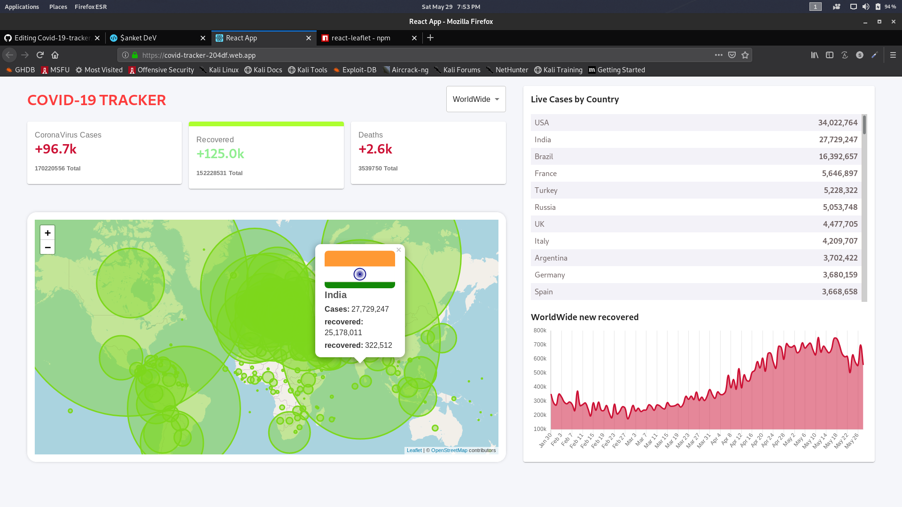
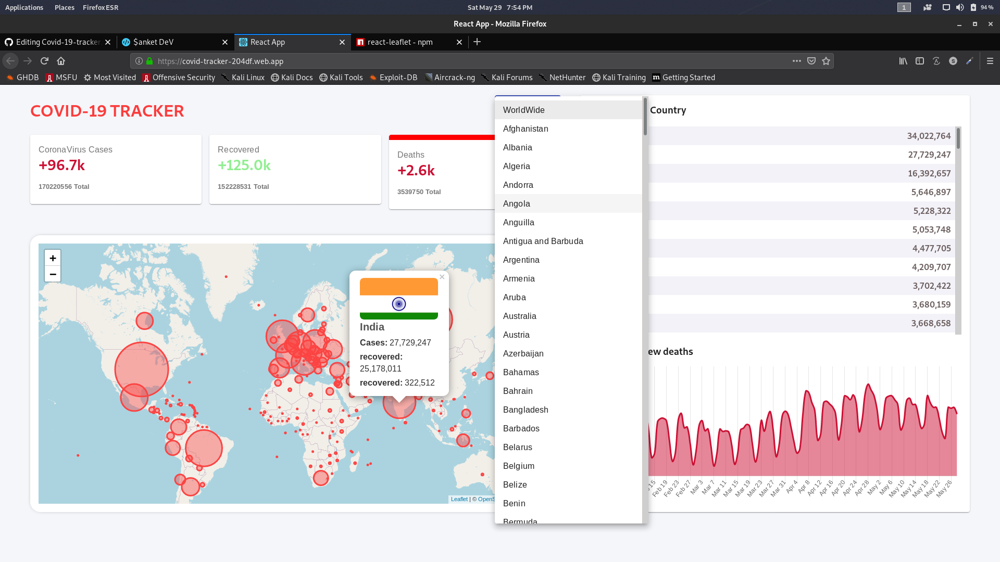

# Covid-19-tracker

[Covid-19-tracker-website Link](https://covid-tracker-204df.web.app/)

This is a reactjs based project along with api and hosted on firebase server

<h2>How To Run</h2>
<h3>Command</h3>
<h3>npx create-react-app your_project_name</h3>

The above command with setup your react app

<h3>npm start</h3>

The above command will run your app on localhost

Now install few modules for the app

  <h3>npm i firebase</h3>
  <h3>npm install @material-ui/core</h3>
  <h3>npm install @material-ui/icons<h3>
  <h3>npm i leaflet</h3>
  <h3>npm i react-leaflet</h3>
  <h3>npm i numeral</h3>
  <h3>npm install chart.js</h3>
  <h3>npm i react-chartjs-2</h3>
  <h3>npm i react-dom</h3>
  

Api used

https://disease.sh/v3/covid-19/all

  
After installations of the packages replace the src folder with your react app created 

  <h3>npm run build</h3>
  
The above command will build the final project

 
<h2>Hosting</h2>
  
Creat your firebase account then in command line use the following commands

  
firebase login

  
Login to your firebase account using command line

  
firebase init

  
Select existing project and choose the project name that you have created in firebase website

  
Then type 'y' for yes and then then type 'build' to create the host

  
  <h3>Project Screenshot</h3>
  
  
  
  
  
  
  
  
  <h3>For more detail follow this youtube video</h3>
  https://www.youtube.com/watch?v=cF3pIMJUZxM&t=15623s
  
 
